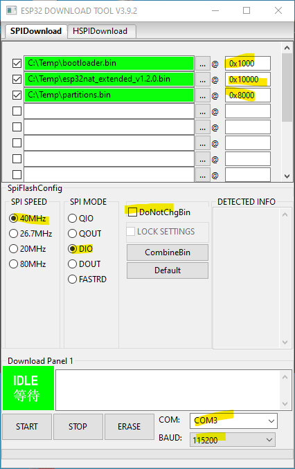

# ESP32 NAT Router Extended

This is a firmware to use the ESP32 as WiFi NAT router. It can be used as
- Simple range extender for an existing WiFi network
- Setting up an additional WiFi network with different SSID/password for guests or IOT devices

This is an extension of the great work of [martin-ger's ESP32 NAT Router-project](https://github.com/martin-ger/esp32_nat_router). I used his project as a starting point for learning microcontroller programming and extended it with some features for my use case. 

## Features / Usage scenarios
- Extend range of WiFi network (Repeater)
- Additional network for guests
- Portable usage with a small, low power device (battery powered)
- [Bypass restrictions](docs/advanced.md#advanced-configuration) in public WiFis, like device and rate limit
- Scanning for APs (s. [limitations](#wifi-scanning-limitation))
- User friendly UI with mobile support
- [Resetting the device](docs/advanced.md#resetting-the-device-erasing-the-flash) in UI and with Pin/Button
- Keep connection alive on networks with forced disconnect
- Secure frontend by password or complete disabling
- Show connected state and quality in UI
- Disable the on board indicator LED 

## First Boot
After first boot the ESP32 NAT Router will offer a WiFi network with an open AP and the ssid "ESP32_NAT_Router". Configuration can either be done via a simple web interface or via the serial console. 

## Web Config Interface
The web interface allows for the configuration of all parameters. Connect you PC or smartphone to the WiFi SSID "ESP32_NAT_Router" and point your browser to "http://192.168.4.1". This page should appear:


First enter the appropriate values for the uplink WiFi network, the "STA Settings". Leave password blank for open networks. Click "Connect". The ESP32 reboots and will connect to your WiFi router.

Now you can reconnect and reload the page and change the "Soft AP Settings". Click "Set" and again the ESP32 reboots. Now it is ready for forwarding traffic over the newly configured Soft AP. Be aware that these changes also affect the config interface, i.e. to do further configuration, connect to the ESP32 through one of the newly configured WiFi networks.

## Screenshots


## Flashing the prebuild binaries
- Download [latest release](https://github.com/dchristl/esp32_nat_router_extended/releases/latest)
  * Download esp32nat_extended_full_vX.X.X.zip for fresh install
  * Download esp32nat_extended_update_vX.X.X.zip for update
- Install [esptool](https://github.com/espressif/esptool)
 

### First install/ Reset 

If your device was used before for other projects or you want to reset all setting from previous version. Complete data loss!
Unpack archive first and then execute:

```
esptool.py write_flash 0x0 esp32nat_extended_full_vX.X.X.bin 

```

### Update from older version
If this project was already installed. No data loss from previous version. 
 
```
esptool.py write_flash 0x10000 esp32nat_extended_vX.X.X.bin 
```

If any problem occurs, erase flash manually before flashing:
```
esptool.py erase_flash
```


### Alternative way/ Graphical (Windows only)
As an alternative you might use [Espressif's Flash Download Tools](https://www.espressif.com/en/support/download/other-tools).

Check the marked parameters and files like below (ckeck the COM-Port for your environment). 

Check the addresses like below: 

### First install/ Reset 



### Update from older version


## Building the Binaries

see [How to setup environment and build](docs/BUILD.md)


## Wifi scanning limitation
Because of technical limitations, a client can not be simultaneously connected to device and scan for Wifis. Before the scan started all the clients will be disconnected. After that the scan will start, saved in nvs and the device will reboot. After reconnecting to the device you will be able to see the scanned networks. The scan result will be deleted afterwards, but it is always possible to retry the scanning. 

## Misc

If you have any problems, suggestions for new features feel free to ask or raise an issue. This is a spare time project, I will answer if I'm free.
If you like my work and want to support me, you can [buy me coffee](https://www.buymeacoffee.com/dchristl) or send me a donation via [PayPal](https://bit.ly/3Gde3KN)

## Advanced topics and configuration

see [Advanced topics](docs/advanced.md)
