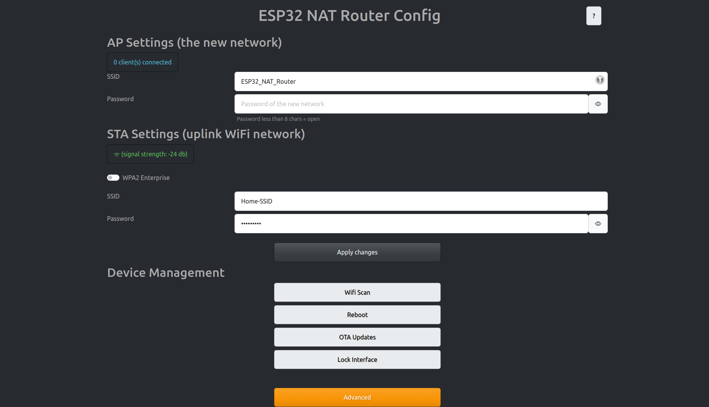
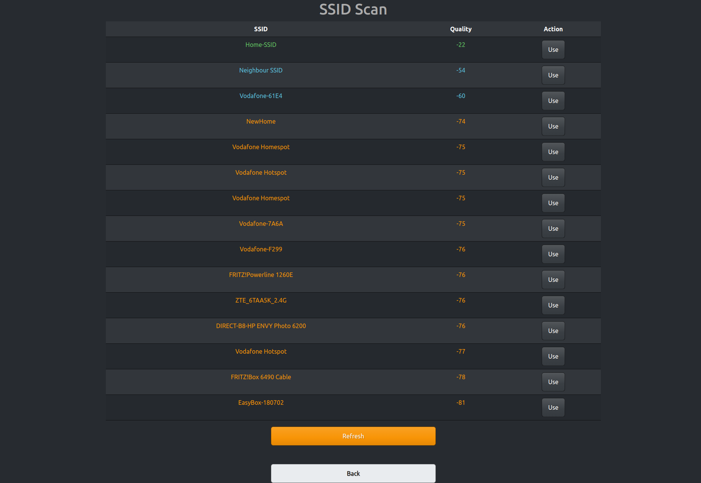
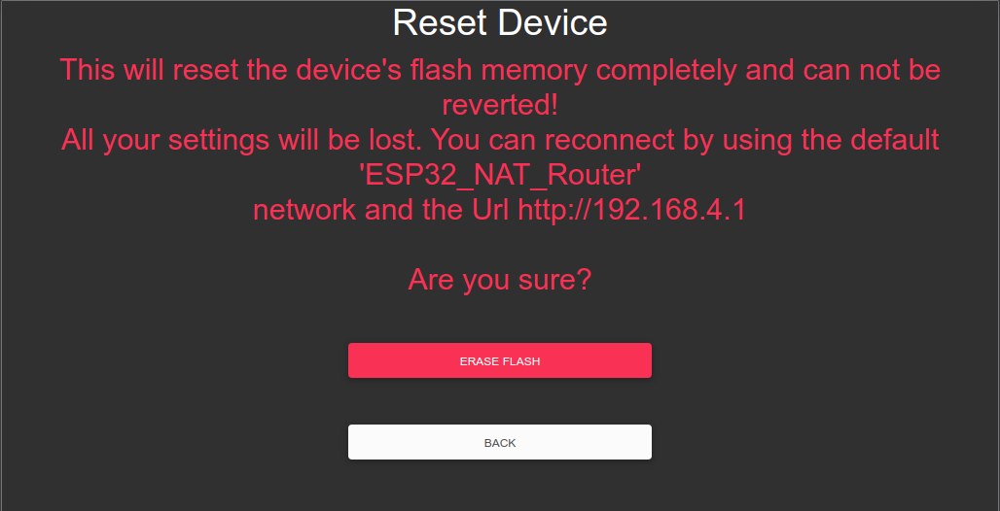
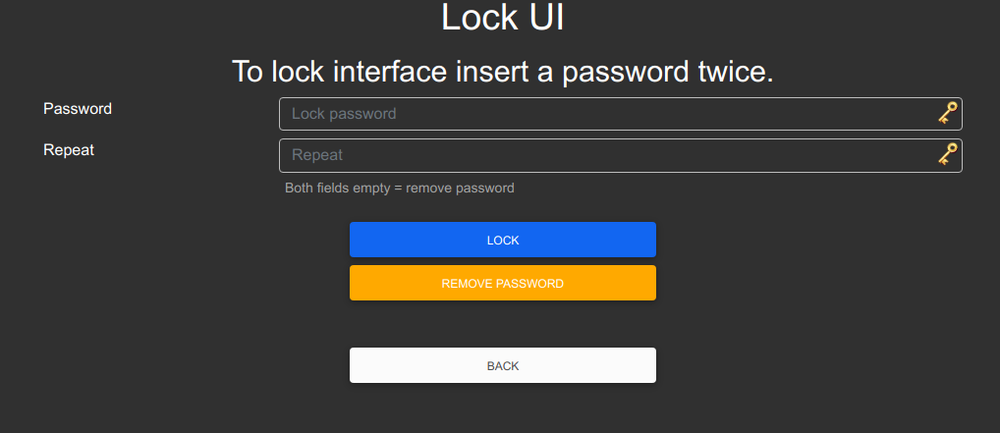
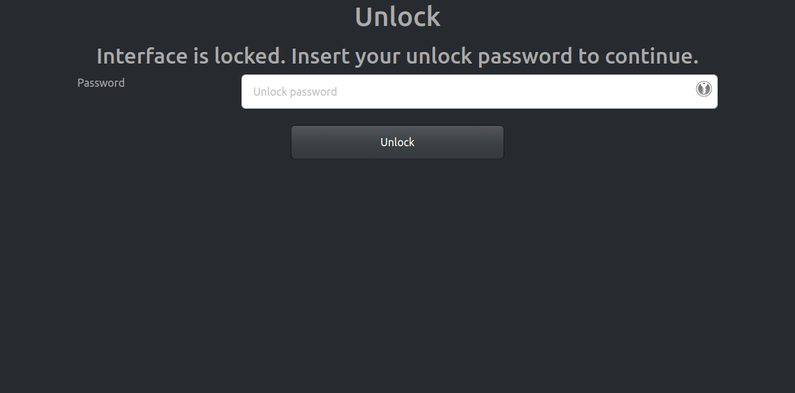

# ESP32 NAT Router Extended

This is a firmware to use the ESP32 as WiFi NAT router. It can be used as
- Simple range extender for an existing WiFi network
- Setting up an additional WiFi network with different SSID/password for guests or IOT devices

This is an extension of the great work of [martin-ger's ESP32 NAT Router-project](https://github.com/martin-ger/esp32_nat_router). I used his project as a starting point for learning microcontroller programming and extended it with some features for my use case. 

## Additional features
- Scanning for APs (s. [Limitations](#wifi-scanning-limitation))
- Resetting the device
- Improved and stabilized UI
- Securing the frontend

## First Boot
After first boot the ESP32 NAT Router will offer a WiFi network with an open AP and the ssid "ESP32_NAT_Router". Configuration can either be done via a simple web interface or via the serial console. 

## Web Config Interface
The web interface allows for the configuration of all parameters. Connect you PC or smartphone to the WiFi SSID "ESP32_NAT_Router" and point your browser to "http://192.168.4.1". This page should appear:



First enter the appropriate values for the uplink WiFi network, the "STA Settings". Leave password blank for open networks. Click "Connect". The ESP32 reboots and will connect to your WiFi router.

Now you can reconnect and reload the page and change the "Soft AP Settings". Click "Set" and again the ESP32 reboots. Now it is ready for forwarding traffic over the newly configured Soft AP. Be aware that these changes also affect the config interface, i.e. to do further configuration, connect to the ESP32 through one of the newly configured WiFi networks.

## Screenshots






## Interpreting the on board LED

If the ESP32 is connected to the upstream AP then the on board LED should be on, otherwise off.
If there are devices connected to the ESP32 then the on board LED will keep blinking as many times as the number of devices connected.

For example:

One device connected to the ESP32, and the ESP32 is connected to upstream: 

`*****.*****`

Two devices are connected to the ESP32, but the ESP32 is not connected to upstream: 

`....*.*....`

# Command Line Interface

For configuration you have to use a serial console (Putty or GtkTerm with 115200 bps).
Use the "set_sta" and the "set_ap" command to configure the WiFi settings. Changes are stored persistently in NVS and are applied after next restart. Use "show" to display the current config. The NVS namespace for the parameters is "esp32_nat"

Enter the `help` command get a full list of all available commands:
```
help 
  Print the list of registered commands

free 
  Get the current size of free heap memory

heap 
  Get minimum size of free heap memory that was available during program execu
  tion

version 
  Get version of chip and SDK

restart 
  Software reset of the chip

deep_sleep  [-t <t>] [--io=<n>] [--io_level=<0|1>]
  Enter deep sleep mode. Two wakeup modes are supported: timer and GPIO. If no
  wakeup option is specified, will sleep indefinitely.
  -t, --time=<t>  Wake up time, ms
      --io=<n>  If specified, wakeup using GPIO with given number
  --io_level=<0|1>  GPIO level to trigger wakeup

light_sleep  [-t <t>] [--io=<n>]... [--io_level=<0|1>]...
  Enter light sleep mode. Two wakeup modes are supported: timer and GPIO. Mult
  iple GPIO pins can be specified using pairs of 'io' and 'io_level' arguments
  . Will also wake up on UART input.
  -t, --time=<t>  Wake up time, ms
      --io=<n>  If specified, wakeup using GPIO with given number
  --io_level=<0|1>  GPIO level to trigger wakeup

tasks 
  Get information about running tasks

nvs_set  <key> <type> -v <value>
  Set key-value pair in selected namespace.
Examples:
 nvs_set VarName i32 -v 
  123 
 nvs_set VarName str -v YourString 
 nvs_set VarName blob -v 0123456789abcdef 
         <key>  key of the value to be set
        <type>  type can be: i8, u8, i16, u16 i32, u32 i64, u64, str, blob
  -v, --value=<value>  value to be stored

nvs_get  <key> <type>
  Get key-value pair from selected namespace. 
Example: nvs_get VarName i32
         <key>  key of the value to be read
        <type>  type can be: i8, u8, i16, u16 i32, u32 i64, u64, str, blob

nvs_erase  <key>
  Erase key-value pair from current namespace
         <key>  key of the value to be erased

nvs_namespace  <namespace>
  Set current namespace
   <namespace>  namespace of the partition to be selected

nvs_list  <partition> [-n <namespace>] [-t <type>]
  List stored key-value pairs stored in NVS.Namespace and type can be specified
  to print only those key-value pairs.
  
Following command list variables stored inside 'nvs' partition, under namespace 'storage' with type uint32_t
  Example: nvs_list nvs -n storage -t u32 

   <partition>  partition name
  -n, --namespace=<namespace>  namespace name
  -t, --type=<type>  type can be: i8, u8, i16, u16 i32, u32 i64, u64, str, blob

nvs_erase_namespace  <namespace>
  Erases specified namespace
   <namespace>  namespace to be erased

set_sta  <ssid> <passwd>
  Set SSID and password of the STA interface
        <ssid>  SSID
      <passwd>  Password

set_sta_static  <ip> <subnet> <gw>
  Set Static IP for the STA interface
          <ip>  IP
      <subnet>  Subnet Mask
          <gw>  Gateway Address

set_ap  <ssid> <passwd>
  Set SSID and password of the SoftAP
        <ssid>  SSID of AP
      <passwd>  Password of AP

set_ap_ip  <ip>
  Set IP for the AP interface
          <ip>  IP

portmap  [add|del] [TCP|UDP] <ext_portno> <int_ip> <int_portno>
  Add or delete a portmapping to the router
     [add|del]  add or delete portmapping
     [TCP|UDP]  TCP or UDP port
  <ext_portno>  external port number
      <int_ip>  internal IP
  <int_portno>  internal port number

show 
  Get status and config of the router
```


## Flashing the prebuild binaries
- Download [latest release](https://github.com/dchristl/esp32_nat_router_extended/releases/latest)
- Install [esptool](https://github.com/espressif/esptool)

### Update from older version
If this project was already installed. No data loss from previous version. 
 
```
esptool.py write_flash 0x10000 esp32nat_extended_vX.X.X.bin 
```

### Fresh install/ Reset 

If your device was used before for other projects or you want to reset all setting from previous version. Complete data loss!

```
esptool.py write_flash 0x0 esp32nat_extended_vX.X.X.bin 
```

### Alternative way/ Graphical (Windows only)
As an alternative you might use [Espressif's Flash Download Tools](https://www.espressif.com/en/support/download/other-tools).

Check the marked parameters and files like below (ckeck the COM-Port for your environment). 

Replace the address **0x10000** with **0x0** if you want a fresh install. 


## Building the Binaries

see [How to setup environment and build](docs/BUILD.md)

### DNS
As soon as the ESP32 STA has learned a DNS IP from its upstream DNS server on first connect, it passes that to newly connected clients.
Before that by default the DNS-Server which is offerd to clients connecting to the ESP32 AP is set to 1.1.1.1.
Replace the value of the *DEFAULT_DNS* with your desired DNS-Server IP address if you want to use a different one.

## Wifi scanning limitation
Because of technical limitations, a client can not be simultaneously conected to device and scan for Wifis. Before the scan started all the clients will be disconnected. After that the scan will start, saved in nvs and the device will reboot. After reconnecting to the device you will be able to see the scanned networks. The scan result will be deleted afterwards, but it is always possible to retry the scanning. 