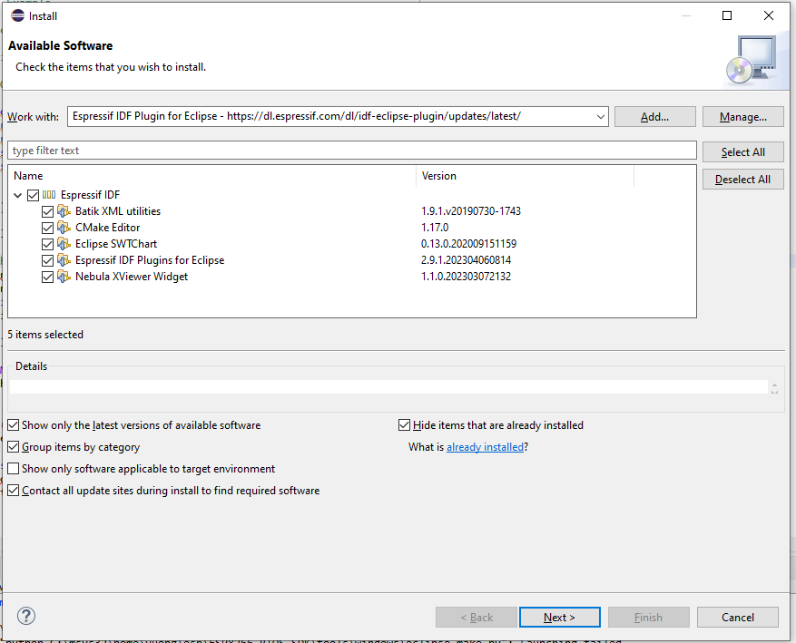
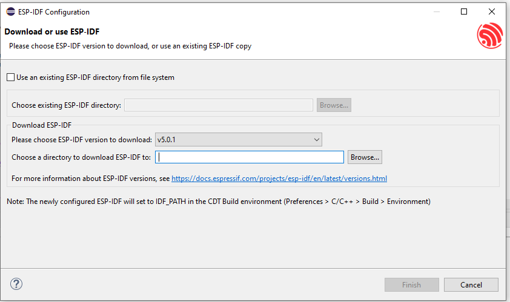
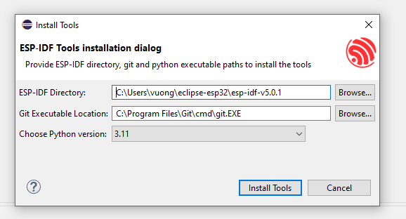
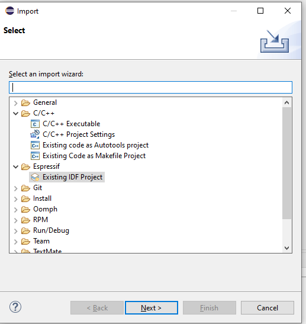
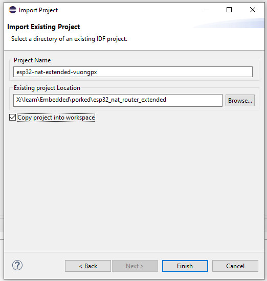
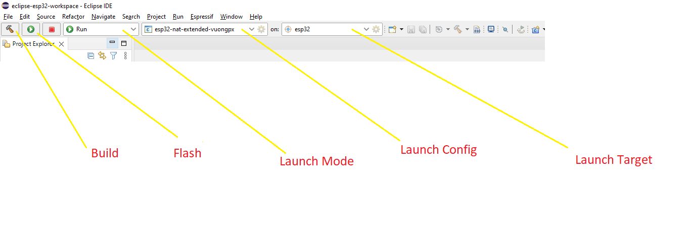

# How to set up environment and build binary with Eclipse for Winddows

## Prerequisites

The minimum requirements for running the IDF Eclipse plug-ins are below. 

* **Java 17 and above** : Download and install Java SE from <a href= "https://www.oracle.com/technetwork/java/javase/downloads/index.html">here</a>
* **Python 3.6 and above** : Download and install Python from <a href="https://www.python.org/downloads/">here</a>
* **Eclipse IDE for C/C++ Developers 2022-09 (2022-09 and 2022-12 also should work)** : Download and install Eclipse CDT package from <a href= "https://www.eclipse.org/downloads/packages/release/2022-09/r/eclipse-ide-cc-developers">here </a>
*  **Git** : Get the latest git from <a href ="https://git-scm.com/downloads">here</a>
*  **ESP-IDF 4.0 and above** : Clone the ESP-IDF repo from <a href ="https://github.com/espressif/esp-idf/releases">here</a>

> **Note:** 
-   Make sure Java, Python and Git are available on the system environment PATH.

## Installing IDF Plugin using update site URL

You can install the IDF Eclipse plugin into an existing Eclipse CDT installation using the update site URL. You first need to add the release repository URL as follows:

1. Go to `Help` > `Install New Software`
1. Click `Add…`, and in the pop-up window:
	* Enter `Name` as `Espressif IDF Plugin for Eclipse`
	* Enter `Location` of the repository:
		* Stable releases: https://dl.espressif.com/dl/idf-eclipse-plugin/updates/latest/
		* Beta versions: https://dl.espressif.com/dl/idf-eclipse-plugin/updates/beta/
		* Nightly build: https://dl.espressif.com/dl/idf-eclipse-plugin/updates/nightly/
	* Click `Add`
1. Select `Espressif IDF` from the list and proceed with the installation 

# Installing ESP-IDF
To install ESP-IDF directly from the Eclipse

1. Go to `Espressif` > `Download and Configure ESP-IDF`
1. From the `Download ESP-IDF` section, choose ESP-IDF version and directory to download
1. Click on `Finish`

To configure an existing ESP-IDF

1. Go to `Espressif` > `Download and Configure ESP-IDF`
1. Check `Use an existing ESP-IDF directory from the file system`
1. Choose an existing ESP-IDF directory from the file system
1. Click on `Finish`

This will download a specified esp-idf version and configures `IDF_PATH` in the Eclipse CDT build environment variables.

## Installing ESP-IDF Tools
ESP-IDF requires some prerequisite tools to be installed so you can build firmware for the ESP32. The prerequisite tools include Python, Git, cross-compilers, menuconfig tool, CMake and Ninja build tools.

For this getting started guide, follow the instructions below.

1. Navigate to `Espressif` > `ESP-IDF Tools Manager` > `Install Tools`
1. Provide the `ESP-IDF Directory` path
1. Provide `Git` and `Python` executable locations if they are not auto-detected.
1. Click on `Install Tools` to proceed with the installation process. Check the Console for the installation details.
1. Installation might take a while if you're doing it for the first time since it has to download and install xtensa-esp32-elf, esp32ulp-elf, cmake, openocd-esp32 and ninja tools.

> **Note:** Make sure you run this step even if you've already installed the required tools, since it sets the `IDF_PATH`, `PATH`, `OPENOCD_SCRIPTS` and `IDF_PYTHON_ENV_PATH` to the Eclipse CDT build environment based on the idf_tools.py export command.

ESP-IDF Directory selection dialog:

## Open Project

1. Make sure you are in `C/C++ Perspective`
1. Go to `File` > `Import` > `Espressif` 
1. Provide the `Project name` (The ESP-IDF build system does not support spaces in the project path)
1. Provide the path which you cloned esp32_nat_router_extended
1. Click `Finish`

## Compiling the Project
1. Select a project from the `Project Explorer`
1. Select `Run` from the first drop-down, which is called `Launch Mode`
1. Select your application from the second drop-down, which is called `Launch Configuration`(Auto-detected)
1. Select target from the third drop-down, which is called `Launch Target`
1. Now click on the `Build` button widget which you see on the far left of the toolbar

