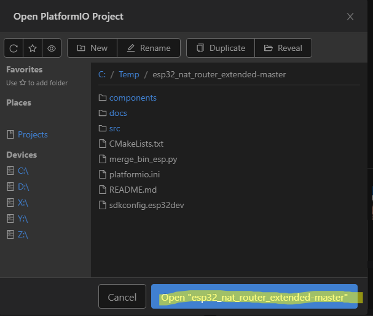
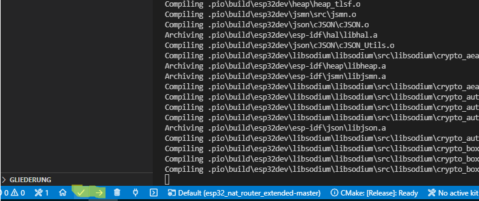

# How to set up environment and build binary

## Prerequisites

- Install [VisualStudio Code](https://code.visualstudio.com/)
- Install [PlatformIO IDE for VSCode](https://platformio.org/install/ide?install=vscode)
- Install [Standard setup toolchain](https://docs.espressif.com/projects/esp-idf/en/latest/esp32/get-started/index.html#get-started-get-prerequisites) for your platform

## Getting started

- Checkout or download sources 

- Open project by selecting the project folder

    

    

    This may take a while, because PlatformIO downloads all the required boards and tools for development.

- make your changes

- you can now compile and/or upload your code

    

- The bin-files (bootloader.bin, firmware.bin, partitions.bin) will be in {project folder}/.pio/build/esp32dev
