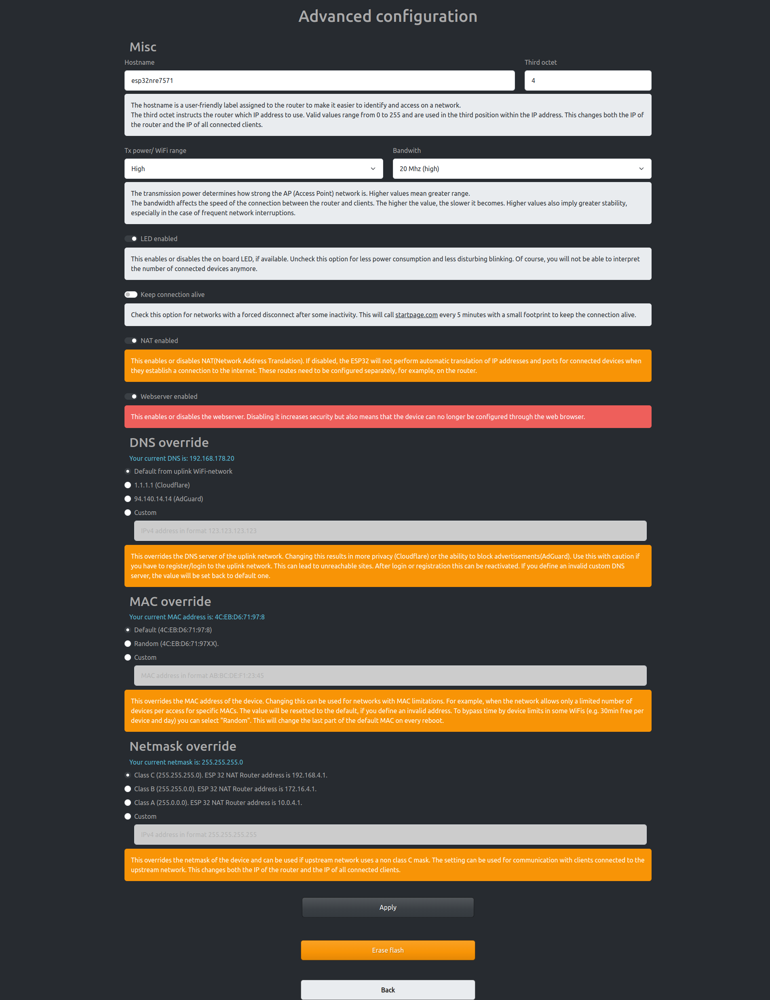

# Advanced topics

## Advanced configuration



The settings under advanced configuration are well explained in the UI. 

## Resetting the device/ Erasing the flash

All settings can be wiped in the UI with the "Erase Flash"-Button. If any misconfiguration leads to an unusable device you can also connect GPIO 23 to ground on startup to reset the device copmpletely. The GND- and the GPIO 23-Pin are normally direct neighbours, so you can bridge them by any metallic object, like a paper clip, knife, small wire, ... If you want to reset, you have to power off the device, bridge the GND and GPIO 23 and power on the device. After 5s with bridged connection, the device is resetted and you can remove the bridge and restart the device. If on your board is an indicator LED available, these will flash fast during this process. 

## Interpreting the on board LED

If the ESP32 is connected to the upstream AP then the on board LED should be on, otherwise off.
If there are devices connected to the ESP32 then the on board LED will keep blinking as many times as the number of devices connected.

For example:

One device connected to the ESP32, and the ESP32 is connected to upstream: 

`*****.*****`

Two devices are connected to the ESP32, but the ESP32 is not connected to upstream: 

`....*.*....`

## Command Line Interface

For configuration you have to use a serial console (Putty or GtkTerm with 115200 bps).
Use the "set_sta" and the "set_ap" command to configure the WiFi settings. Changes are stored persistently in NVS and are applied after next restart. Use "show" to display the current config. The NVS namespace for the parameters is "esp32_nat"

Enter the `help` command get a full list of all available commands:
```
help 
  Print the list of registered commands

free 
  Get the current size of free heap memory

heap 
  Get minimum size of free heap memory that was available during program execu
  tion

version 
  Get version of chip and SDK

restart 
  Software reset of the chip

deep_sleep  [-t <t>] [--io=<n>] [--io_level=<0|1>]
  Enter deep sleep mode. Two wakeup modes are supported: timer and GPIO. If no
  wakeup option is specified, will sleep indefinitely.
  -t, --time=<t>  Wake up time, ms
      --io=<n>  If specified, wakeup using GPIO with given number
  --io_level=<0|1>  GPIO level to trigger wakeup

light_sleep  [-t <t>] [--io=<n>]... [--io_level=<0|1>]...
  Enter light sleep mode. Two wakeup modes are supported: timer and GPIO. Mult
  iple GPIO pins can be specified using pairs of 'io' and 'io_level' arguments
  . Will also wake up on UART input.
  -t, --time=<t>  Wake up time, ms
      --io=<n>  If specified, wakeup using GPIO with given number
  --io_level=<0|1>  GPIO level to trigger wakeup

tasks 
  Get information about running tasks

nvs_set  <key> <type> -v <value>
  Set key-value pair in selected namespace.
Examples:
 nvs_set VarName i32 -v 
  123 
 nvs_set VarName str -v YourString 
 nvs_set VarName blob -v 0123456789abcdef 
         <key>  key of the value to be set
        <type>  type can be: i8, u8, i16, u16 i32, u32 i64, u64, str, blob
  -v, --value=<value>  value to be stored

nvs_get  <key> <type>
  Get key-value pair from selected namespace. 
Example: nvs_get VarName i32
         <key>  key of the value to be read
        <type>  type can be: i8, u8, i16, u16 i32, u32 i64, u64, str, blob

nvs_erase  <key>
  Erase key-value pair from current namespace
         <key>  key of the value to be erased

nvs_namespace  <namespace>
  Set current namespace
   <namespace>  namespace of the partition to be selected

nvs_list  <partition> [-n <namespace>] [-t <type>]
  List stored key-value pairs stored in NVS.Namespace and type can be specified
  to print only those key-value pairs.
  
Following command list variables stored inside 'nvs' partition, under namespace 'storage' with type uint32_t
  Example: nvs_list nvs -n storage -t u32 

   <partition>  partition name
  -n, --namespace=<namespace>  namespace name
  -t, --type=<type>  type can be: i8, u8, i16, u16 i32, u32 i64, u64, str, blob

nvs_erase_namespace  <namespace>
  Erases specified namespace
   <namespace>  namespace to be erased

set_sta  <ssid> <passwd>
  Set SSID and password of the STA interface
        <ssid>  SSID
      <passwd>  Password

set_sta_static  <ip> <subnet> <gw>
  Set Static IP for the STA interface
          <ip>  IP
      <subnet>  Subnet Mask
          <gw>  Gateway Address

set_ap  <ssid> <passwd>
  Set SSID and password of the SoftAP
        <ssid>  SSID of AP
      <passwd>  Password of AP

set_sta_ent  <ssid> <identity> <user> <passwd>
  Set up WPA Enterprise in STA mode
        <ssid>  SSID
    <identity>  Identity
        <user>  User
      <passwd>  Password      

set_ap_ip  <ip>
  Set IP for the AP interface
          <ip>  IP

portmap  [add|del] [TCP|UDP] <ext_portno> <int_ip> <int_portno>
  Add or delete a portmapping to the router
     [add|del]  add or delete portmapping
     [TCP|UDP]  TCP or UDP port
  <ext_portno>  external port number
      <int_ip>  internal IP
  <int_portno>  internal port number

show 
  Get status and config of the router
```
### NVS-Parameters in esp32 namespace

| Parameter   | Type | Hints
| ----------- | ----------- | ------- |
| ap_ssid      | str       |SSID of the AP network|
| ap_passwd   | str        | Password of the AP network|
| ssid_hidden   | i32        | Hide the AP SSID |
| ssid      | str       |SSID of the STA network|
| keep_alive   | i32        | Keep the connection alive|
| led_disabled   | i32        | Is the LED disabled|
| nat_disabled   | i32        | Is NAT disabled|
| lock   | i32        | Webserver is disabled|
| custom_mac   | str        | Custom Mac address or "random"|
| custom_dns   | str        | Custom DNS address|
| hostname   | str        | Custom hostname|
| lock_pass   | str        | Password for the UI lock|
| scan_result   | str        | Temporary parameter for the last scan result|
| result_shown   | i32        | Counter how many times the result was already shown (>3 = delete result)|
| txpower   | i32        | How much tx power should be used (between 8 and 84), larger, more power|
| netmask   | str        | Value of the network class to use (classa, classb or classc)  |
| sta_identity   | str        | Identity for WPA enterprise |
| sta_user   | str        | WPA Enterprise username|
| cer   | str        | Content of the WPA Enterprise certificate |
| ota_url   | str        | Url to the binary for OTA-Updates |
| canary   | i32        | Use the canary/nightly builds for OTA-Updates  |
| loglevel   | str        | Sets the loglevel. Valid values: n -> log off; d -> log debug; v-> log verbose; i -> log info (default) |


# DNS
As soon as the ESP32 STA has learned a DNS IP from its upstream DNS server on first connect, it passes that to newly connected clients.
Before that by default the DNS-Server which is offerd to clients connecting to the ESP32 AP is set to 192.168.4.1 and sets up a [Captive portal](https://en.wikipedia.org/wiki/Captive_portal). All DNS (http) resolutions will be resolved to 192.168.4.1 itself, so any input will lead to the start page.

# Modified parameters compared to the default configuration 

| Location   | Value | Hints
| ----------- | ----------- | ------- |
| Component config > LWIP > Enable copy between Layer2 and Layer3 packets.     | Activated       ||
| Component config > LWIP > Enable IP forwarding     | Activated       ||
| Component config > LWIP > Enable NAT (new/experimental)    | Activated       ||
| Component config > LWIP > Enable NAT (new/experimental)    | Activated       ||
| Component config > ESP-TLS > Allow potentially insecure options    | Activated       |For OTA-Updates|
| Component config > ESP-TLS > Skip server certificate verification by default | Activated   | For OTA-Updates       |
| Component config > ESP HTTPS OTA > Allow HTTP for OTA | Activated   | For OTA-Updates with custom urls       |
| Component config > HTTP-Server > Max HTTP Request Header Length   | 6144   | Max size for post requests (i.e. certificate)    |
| Component config > Log output > Maximum log verbosity  | Verbose   | To change the log level dynamically    |
