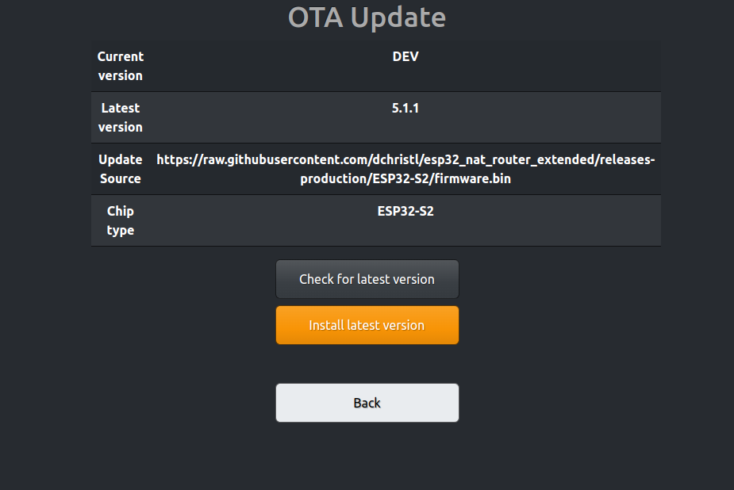
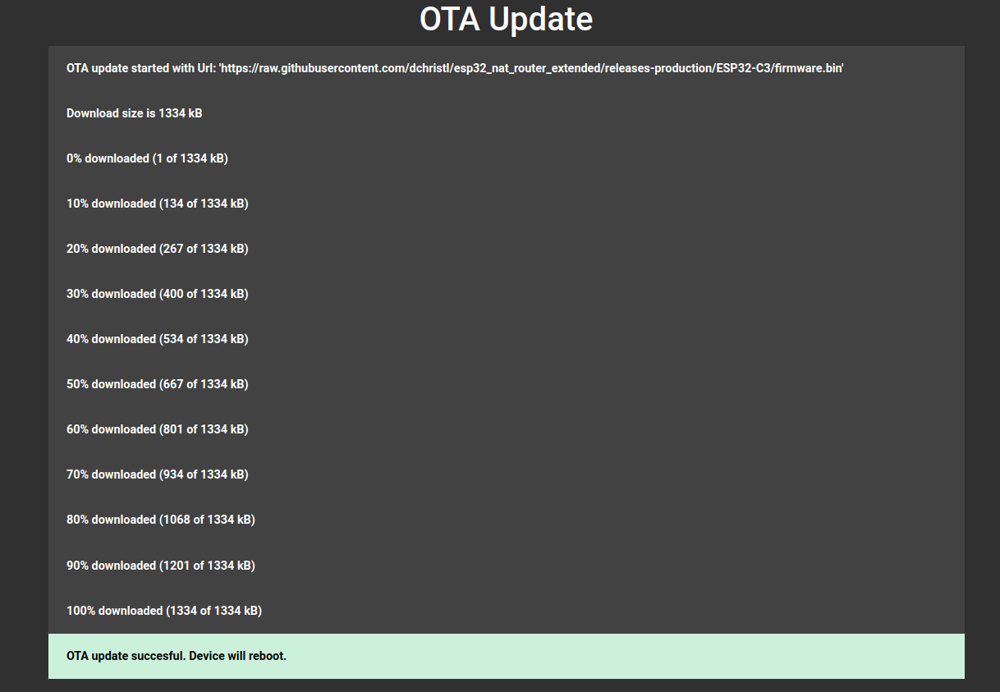
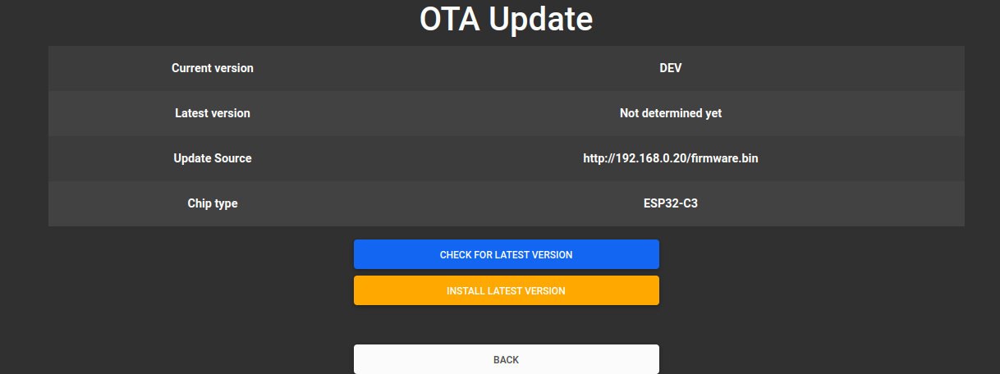

# OTA Update

## Default

The ESP32 OTA (Over-The-Air) process allows firmware updates to be performed on ESP32 devices wirelessly, without the need for physical access to the device. The new firmware will be downloaded to your device (the device must therefore be connected to an uplink network with internet access). After that it will be installed, followd by a reboot and the new firmware becomes active. 






## Updates with custom url

It is also possible to specify a different URL for the update. This can be used, for example, to host your own version. 
You can achieve this by setting the 'ota_url' variable over the serial connection. This should be the complete path, including the '.bin' extension.

```
nvs_namespace esp32_nat
nvs_set ota_url str -v http://192.168.0.20/firmware.bin 
```

